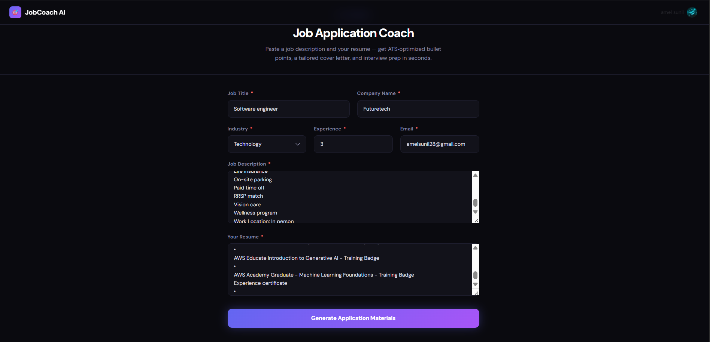
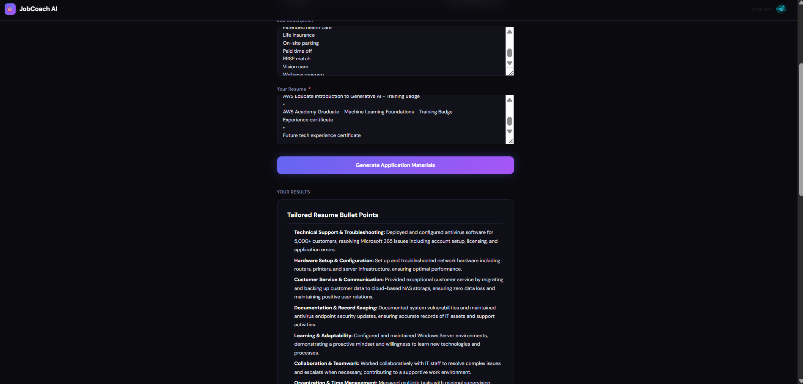
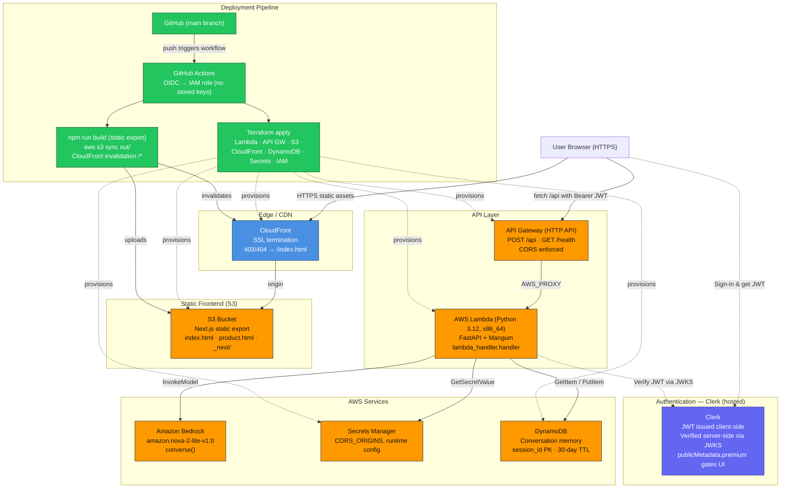

# Job Application Coach

An AI-powered SaaS that turns a job description and a candidate's resume into tailored resume bullets, a customized cover letter, and interview prep — in a single click.

## Screenshot





## Live Demo

**https://d2r5urwl6zhsfw.cloudfront.net/**

> Replace with your CloudFront distribution URL after deployment.

## Technology Stack

**Frontend**
- Next.js 16 (Pages Router, static export via `output: "export"`)
- React 19, TypeScript
- Tailwind CSS v4
- Clerk (`@clerk/nextjs`) for authentication + gated premium content
- `react-markdown` for rendering AI output

**Backend**
- AWS Lambda (Python 3.12, x86_64)
- FastAPI + Mangum (ASGI → Lambda adapter)
- Pydantic v2 for request validation
- `fastapi-clerk-auth` for JWT verification via JWKS
- `boto3` for AWS SDK calls

**AWS Services**
- API Gateway (HTTP API) — front door, CORS, routes to Lambda
- Amazon Bedrock — `amazon.nova-2-lite-v1:0` for generation
- DynamoDB — conversation memory (30-day TTL)
- Secrets Manager — runtime config (`CORS_ORIGINS`, etc.)
- S3 — static frontend hosting
- CloudFront — HTTPS/CDN + SPA-style 403/404 → `/index.html`
- IAM (OIDC) — GitHub Actions → assumed role, no long-lived keys

**Infrastructure & CI/CD**
- Terraform (`infra/` directory) for all AWS resources
- GitHub Actions for build + deploy
- Clerk (hosted) for authentication

## Architecture Overview



**Request flow:** Browser → CloudFront → API Gateway → Lambda. Lambda validates the Clerk JWT (JWKS), loads any prior conversation from DynamoDB, calls Bedrock's `converse()` with the system + user prompt, persists the turn back to DynamoDB, and returns the generated Markdown.

## Local Development Setup

**Prerequisites:** Node.js 20+, Python 3.12, an AWS account, a Clerk account.

```bash
# 1. Clone
git clone https://github.com/<you>/job-application-coach.git
cd job-application-coach

# 2. Frontend deps
npm install

# 3. Backend deps (for local FastAPI run)
python -m pip install -r requirements.txt
```

Create `.env.local` at the project root:

```env
NEXT_PUBLIC_CLERK_PUBLISHABLE_KEY=pk_test_...
CLERK_SECRET_KEY=sk_test_...
CLERK_JWKS_URL=https://<your-tenant>.clerk.accounts.dev/.well-known/jwks.json
NEXT_PUBLIC_API_URL=http://localhost:8000
BEDROCK_REGION=us-east-1
BEDROCK_MODEL_ID=global.amazon.nova-2-lite-v1:0
USE_DYNAMODB=false
CORS_ORIGINS=http://localhost:3000
```

Run frontend and backend in two terminals:

```bash
# Terminal 1 — Next.js
npm run dev                     # http://localhost:3000

# Terminal 2 — FastAPI (local)
uvicorn server:app --reload --port 8000
```

## Deployment

**Infrastructure (Terraform).** All AWS resources — Lambda, API Gateway, S3, CloudFront, DynamoDB, Secrets Manager, IAM roles — are defined in `infra/`. From that folder run `terraform init` once, then `terraform apply` to provision or update the stack; a `dev` workspace is used by default.

**Application (GitHub Actions).** On every push to `main`, the workflow assumes an IAM role via OIDC (no stored AWS keys), packages the Python Lambda, runs `terraform apply`, builds the Next.js static export (`npm run build`), syncs `out/` to S3, and invalidates the CloudFront cache (`/*`) so users see the new version immediately.

## API Endpoints

### `GET /health`

Unauthenticated liveness probe.

**Response `200`**
```json
{ "status": "healthy", "version": "1.0" }
```

### `POST /api`

Generate tailored application materials. **Requires** `Authorization: Bearer <Clerk JWT>`.

**Request body**
```json
{
  "job_title": "Senior Data Engineer",
  "company_name": "Acme Corp",
  "job_description": "...at least 50 characters...",
  "resume_text": "...at least 50 characters...",
  "years_experience": 5,
  "target_industry": "Technology",
  "session_id": "optional-string"
}
```

| Field | Type | Constraints |
|---|---|---|
| `job_title` | string | min length 2 |
| `company_name` | string | min length 2 |
| `job_description` | string | min length 50 |
| `resume_text` | string | min length 50 |
| `years_experience` | integer | 0 – 50 |
| `target_industry` | string | default `"General"` |
| `session_id` | string | optional; defaults to Clerk `user.id` |

**Response `200`**
```json
{
  "response": "## Tailored Resume Bullet Points\n...\n## Cover Letter Draft\n...\n## Interview Preparation Tips\n...",
  "session_id": "user_2abc..."
}
```

**Error responses**
- `401` — missing or invalid JWT
- `422` — request body fails Pydantic validation
- `5xx` — Bedrock throttling or model error

## Known Limitations

1. **No streaming in production.** The Lambda returns the full Bedrock response as a single JSON payload after it's generated. On long outputs users wait 10–20 seconds with no feedback. *Production fix:* switch to a streaming-capable transport — either a Lambda Function URL with response streaming enabled, or move the real-time path to App Runner / ECS where Server-Sent Events survive the gateway hop, and re-enable `fetchEventSource` on the client.

2. **Conversation memory is per-session, not truly multi-turn.** DynamoDB stores the conversation with a 30-day TTL, but Lambda loads history only to persist it — the `converse()` call currently doesn't replay prior turns, so the model treats every request as cold. *Production fix:* pass `conversation` as the `messages` array into Bedrock, add a token-budget trimmer, and surface a "New session" control in the UI so users can start fresh intentionally.

## Future Improvements

1. **Resume file upload (PDF / DOCX).** Today users paste raw text. A real product would accept uploads, parse them with Textract or a `pdf-parse` + `python-docx` pipeline, and optionally OCR scanned resumes — dramatically reducing friction for the target user.

2. **Application tracker.** Once the tailored materials are generated, save each application as a record (job, company, status, tailored output) so users can see a pipeline view, set follow-up reminders, and re-run the coach against an updated resume. This turns a one-shot tool into a product users return to weekly.
